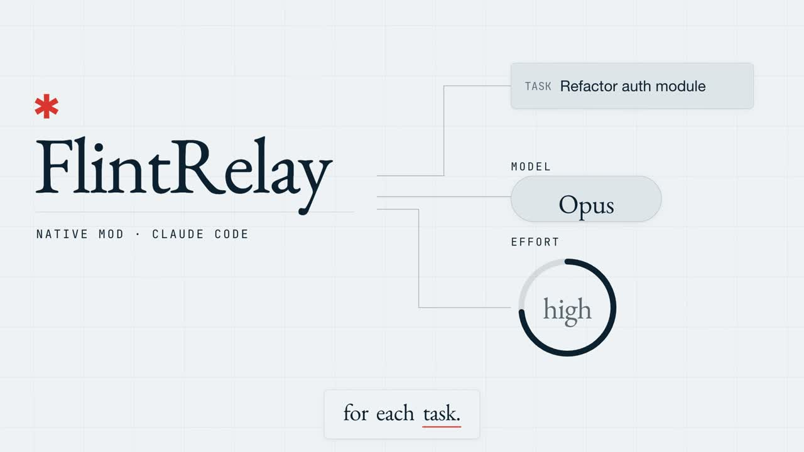

<p align="center">
  <picture>
    <source media="(prefers-color-scheme: dark)" srcset="assets/branding/flintrelay-logo-dark.png">
    
  </picture>
</p>

[עברית](README.he.md)

# FlintRelay — preview 0.2.2

A native Claude Code Mod that recommends a model and per-task effort, preserves user control, and can promote the main conversation to a stronger family. It uses Claude Code's existing request path. It does not add a gateway, classifier request, or inference SDK.

**Status:** implemented and tested with native offline stubs on **2.1.290**, **2.1.293** and the macOS Desktop engine **2.1.286**. No live model-quality or savings experiment has run. Automatic model downgrades are disabled; active effort can rise or fall. This is a source preview, not a production quality certification.

## Watch the 30-second overview

[](docs/media/flintrelay-overview.mp4)

[Watch the video](docs/media/flintrelay-overview.mp4) (30 s, English narration with captions). It shows what FlintRelay does and what it does not do: it recommends a model and effort per task, adds no gateway, classifier request or inference SDK, and starts in shadow mode until you enable active routing.

## Compatibility

| Host | Behavior |
| --- | --- |
| CLI 2.1.290 | Native validator and stubbed integration tests pass; active can be explicitly enabled |
| Claude Code 2.1.293 (including the engine embedded in current macOS Desktop) | Native validator and offline matrix pass; active can be explicitly enabled |
| CLI 2.1.284 | Native test command refuses Mods by default; not supported for active routing |
| Other CLI versions | Shadow/diagnostics if the host can load the plugin; active refuses until that exact version is tested |
| macOS Desktop engine 2.1.286 | Native validation and offline matrix pass; active can be explicitly enabled |
| Other Desktop engines, extension, SDK | Active support and live quality are not certified in this preview |

Desktop embeds its own Claude Code engine; upgrading the terminal CLI does not upgrade Desktop. `/router doctor` reports the engine of the current conversation.

The documented stable terminal floor is 2.1.287. Meeting that floor alone does not enable this preview's active mode. Account model restrictions and native fallbacks still apply. The router's family allowlist does not prove that your subscription or API account can access a model. [Official Mods support](https://code.claude.com/docs/en/plugins/mods/overview)

## Install from GitHub

Use exact Claude Code **2.1.290** or **2.1.293**, or macOS Desktop with its tested **2.1.286** engine, for this preview. Installing the plugin does not upgrade Claude. Newer versions need a compatibility pass before active routing is enabled.

```sh
claude plugin marketplace add QueryKeys/flintrelay
claude plugin install flintrelay@querykeys-flintrelay
```

Restart Claude Code. If configuration is requested, run `/plugin configure flintrelay@querykeys-flintrelay` and review the five defaults (shadow, balanced, sonnet/opus, persistence off, automatic effort). Then run `/router doctor` and `/router status`. Shadow is the default; enable active explicitly only when ready. The marketplace follows this repository; updates follow the plugin's version. Read the [official marketplace guide](https://code.claude.com/docs/en/plugin-marketplaces).

Download a fixed preview from [Releases](https://github.com/QueryKeys/flintrelay/releases). The release ZIP includes the plugin, license and documentation; verify its SHA-256 before extracting it. Load the extracted root with `--plugin-dir` as shown below.

## Try the source

Use a compatible CLI you already trust. Loading a source directory is an alternative to marketplace installation.

```sh
claude --version
claude plugin validate --strict --json /absolute/path/to/flintrelay
claude plugin test /absolute/path/to/flintrelay
claude --plugin-dir /absolute/path/to/flintrelay
```

The last command starts a normal interactive Claude session. Your own prompts will use your plan or API allocation as usual. Validation and `plugin test` use no model inference.

Inside that session:

```text
/router doctor
/router status
/router mode active
```

Shadow is the default. `mode active` is a deliberate grant of control for this session. A trusted terminal or Remote Control user must run it; another plugin, a peer, an unstamped command, or an SDK origin cannot grant control.

## Commands

| Command | Meaning |
| --- | --- |
| `/router status` | Mode, profile, ownership, effort policy and lock |
| `/router doctor` | Host, exact tested versions, readiness and limits |
| `/router mode off` | Stop routing and ongoing collection; survives clear/resume and native switches |
| `/router mode shadow` | Recommend only; revoke ownership |
| `/router mode active` | Acquire current native model as the owned session baseline |
| `/router profile balanced` | Recommend based on local bilingual task rules |
| `/router profile quality` | Prefer an Opus floor for nonempty new tasks |
| `/router effort auto` | Adapt effort up or down on recognized tasks while active |
| `/router effort preserve` | Preserve incoming effort; retain model routing compatibility checks |
| `/router lock` | Revoke ownership; preserve native model choices |
| `/router unlock` | Return to shadow; does not reacquire ownership |
| `/router escalate` | Request an Opus and high-effort floor for the current or next turn, at most once |
| `/router report` | Observed request/token counts, unknown usage, mismatch and truncation counts |
| `/router reset` | Revoke ownership, clear live records and delete router-owned persisted metrics if enabled |

Read-only status/report/doctor may be called without a trusted mutation origin. Commands print local text; they do not send a model request. The name `/router` is registered at runtime; if another command already uses that name, this plugin refuses active control and leaves it untouched.

## Routing rules and limits

- The local classifier suggests Opus for architecture, difficult diagnosis or sensitive changes; Sonnet for ordinary engineering; Haiku for bounded mechanical candidates; and `keep` for insufficient evidence.
- Preview active mode **promotes only**. A Haiku recommendation cannot lower Sonnet or Opus. Potential savings require a cheaper baseline selected by the user and a measured comparison; promotion can increase usage cost.
- Existing Opus stays Opus, even when a smaller family is recommended. Unknown model IDs and expanded-context modifiers abstain.
- A request must match both the session's current native model and the baseline explicitly granted to the router. A model change revokes ownership; a transient override protects the rest of its turn.
- Skill expansion conservatively blocks routing for in-flight turns and the next started turn, because the native skill event exposes no turn ID. Reset clears that pending marker. Subagent requests pass through unchanged.
- Active `effort_policy=auto` selects effort locally for the current turn. It can replace an incoming `xhigh` or `max` with a compatible lower level and allow a previously blocked model promotion. Numeric internal budgets remain unchanged. In `preserve`, advanced/numeric effort continues to prevent incompatible alias promotion.
- A mismatch between a router promotion and the reported answering family stops further promotions for that turn. No inference retry is initiated by the plugin.
- Task classification understands plain conversational wording in English and Hebrew as well as technical terms (see `lib/signals.ts`); acknowledgements and open questions abstain. Task classification is deterministic and heuristic. It is not a calibrated guarantee of model quality. Prompts are never changed or added to.
- The router does not execute tests, infer success from stdout, approve tools, replace your process skills, or change permission settings.

## Per-task effort

| Recognized task | Recommendation |
| --- | --- |
| Bounded formatting, extraction or summarization | `low` |
| Ordinary feature/function/test implementation | `medium` |
| Debugging, root-cause work, architecture, security or migration | `high` |
| Explicitly deep/comprehensive architecture or sensitive analysis | `xhigh` on a verified compatible ID; otherwise `high` |
| Empty or ambiguous instruction | Keep the incoming effort |

Effort is selected independently of the model floor: the `quality` profile may request Opus with low effort for a bounded formatting task. Mixed tasks receive the highest recognized effort requirement. Automatic `max` is not selected. These rules are heuristics, not calibrated quality guarantees. [Official effort guidance](https://code.claude.com/docs/en/model-config#adjust-effort-level), [API effort](https://platform.claude.com/docs/en/build-with-claude/effort).

The tested native engines clamp rewritten effort to their model and organization/settings limits before inference. Exact compatible IDs can receive `xhigh`; promotion targets are provider-dependent aliases and use common levels through `high`. Unknown versions and unchanged unsupported models receive no injected effort. Haiku 5.5 effort is not admitted on these older hosts. Changing effort can affect prompt caching; savings remain unmeasured.

A trusted native `/effort` command puts the router into `preserve` for this session and passes through to Claude. Resume adaptation explicitly with `/router effort auto`. Model switches revoke all routing ownership; Skills protect affected turns. The step contract exposes no startup effort provenance: `--effort`, environment overrides and an already-saved default cannot be distinguished reliably from each other. To retain those choices, configure `effort_policy=preserve` or run `/router effort preserve` before active mode. Automatic mode intentionally adapts incoming defaults, including a saved `xhigh`, without writing global Claude settings.

Shadow prints the recommendation and forwards the incoming request unchanged. Reports count requested effort, while answered effort remains **unobserved**: native caps and other hooks may change it after this plugin. No extra inference request is used to classify the task.

## Options

The manifest exposes startup `mode` (`off` or `shadow`), `profile` (`balanced` or `quality`), `allowed_models` (comma-separated `sonnet,opus`), `persist_metrics` (default `false`), and `effort_policy` (`auto`, default, or `preserve`). Unknown or malformed options invalidate active mode.

`active` cannot be a startup default. Exact runtime ownership must be granted in each session. Native plugin configuration is managed by Claude Code; the product contains no installer that edits global settings or cached agents.

## Measurement and privacy

`report` deduplicates observed `turn.step` results by epoch, turn, agent and step within the last 1,000 retained request keys. A repeated evicted key can be counted again; truncation is disclosed. Optional clock failures keep known usage and leave unavailable timing null. Failed streams remain observed requests; unknown usage is retained as unknown. Dropped observations make completeness false. Uncached input, output, cache reads and cache writes are separate. Unknown usage is unknown. An evicted history is partial; turn totals are not added a second time.

Only 64 turn decisions and 1,000 request records are kept in memory. No prompt, source code, answer, command, path, credential or prompt hash is persisted. When `persist_metrics` is explicitly enabled, only versioned daily category/request-count aggregates and coverage counters are written to this plugin's local store. Daily counters are independent of request-ring eviction and do not shrink when detailed entries leave memory. Version 2 coverage discloses the bounded deduplication window, evicted-key risk, unknown timestamps and dropped observations. Persistence does not currently save token totals across sessions. Records are bounded to 30 days and at most 1,000 category records. Storage failure does not replace a model response. Reset serializes deletion after prior writes, invalidates old snapshots, and reports incomplete persisted deletion in its acknowledgement.

There is no external telemetry, environment inspection, file reading, subprocess execution, or auxiliary model call. The native validator lists the API calls used by the module. Existing tool permissions and hooks are passed through.

A report covers the native steps this plugin observed. It does not claim to cover every internal retry, compaction, side query or helper call. API dollars remain `unknown` without a validated rate/billing source. Subscription quota is not converted into dollars or a guaranteed savings percentage. [Usage semantics](https://code.claude.com/docs/en/costs)

## Development

```sh
claude plugin test .
claude plugin validate --strict --json .
```

For the default, persistence-enabled, configured-off and effort-preserve profiles, run the isolated matrix:

```sh
python3 scripts/test-matrix.py --claude /absolute/path/to/trusted/claude
```

The matrix requires an exact tested 2.1.286, 2.1.290 or 2.1.293 engine, creates temporary source copies and a temporary Claude configuration, and runs only validation/offline tests. It never installs or upgrades Claude and never submits a prompt. Persistence, off and preserve fixtures are deliberately named `.fixture.ts`; the matrix enables and loads them in copied profiles.

Native tests use `claude-code/testing` with stubs at external boundaries. No sign-in or network is needed. TypeScript checks for pure modules can run with TypeScript 5.9.3 (CI) or 7.0.2; both pass `tsc -p tsconfig.json` on 2026-10-09. Native adapter declarations must come from the exact host before claiming authoritative type compatibility; the public declarations available during development were older.

## Disable or remove

Exit the session launched with `--plugin-dir` and start a normal session without that flag. If you later install the plugin through a marketplace, disable only `flintrelay` through `/plugin`. There is no need to disable Caveman, Superpowers, ECC, other security hooks or your status line.

## Release boundary

A future quality trial must predeclare tasks, models, acceptance checks, sample size, usage budget and stop conditions. Shadow suggestions do not demonstrate counterfactual quality. This preview has no permission to enable credits, change authentication, route through a proxy, or run paid comparison experiments.

Released under the [MIT License](LICENSE). This is an independent community project; it is not an Anthropic product or endorsement. Release archives contain original source and tests, not the Claude Code executable or downloaded dependencies.

See [validation evidence](docs/validation.md), [research](docs/research.md), [privacy](PRIVACY.md), [contributing](CONTRIBUTING.md) and [security reporting](SECURITY.md).

With Node 24.15.0, reproduce the deterministic case check and classifier benchmark:

```sh
node scripts/check-cases.mjs
node scripts/benchmark.mjs
```

These development scripts read only the local policy/case definitions and do not run a model. Offline quality case definitions are in `evaluation/cases.json`. They are acceptance specifications, not completed model evaluations or a representative workload certification.
